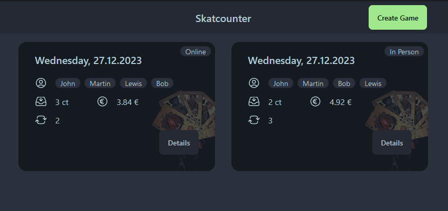
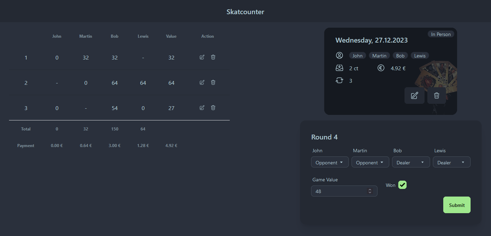
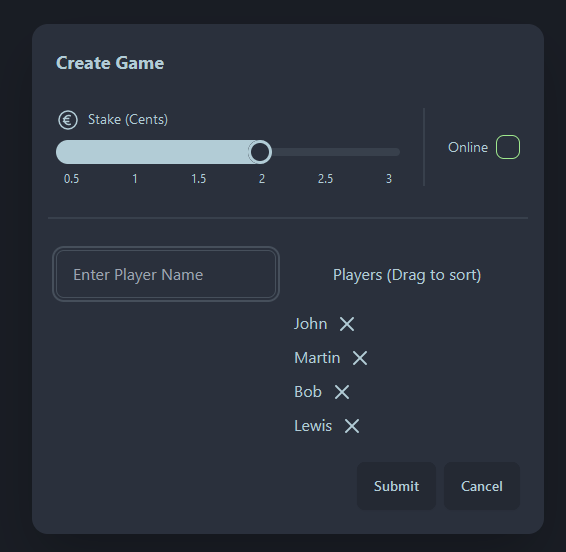

# Skat-Counter - Web-App to track your Skat games

Skat-Counter is a simple Go application i started writing in order to learn about [htmx](https://htmx.org/), [templ](https://github.com/a-h/templ) and [jet](https://github.com/go-jet/jet). For the time being it is kind of experimental and a lot of things like proper error handling and logging are still missing.

Nevertheless it is in a working state and can be used for testing purposes.
For data storage, SQLite is being used.

## Features

- Manage Skat-Games
  - Creation time
  - Did you play online (e.g. Tabletop Simulator) or in person?
  - How high is the stake?
  - Variable number of players
- Manage Rounds
  - Roles (Declarer, Opponents, Dealer)
  - Declarer won the game?
  - How much was the value of the game
- Automated polling: data will be updated every 10 seconds, no need the refresh the page
 
The features and calculations are designed towards the way that my friends and i play Skat, depending on your rules, it might not be suitable for you.

## Installation

### Go Binary

```
go install github.com/tarow/skat-counter@latest
```

### Docker

```bash
docker run -v ./data:/app ghcr.io/tarow/skat-counter:main
```

### Docker Compose

```yaml
version: "3.7"

services:
  skat-counter:
    image: ghcr.io/tarow/skat-counter:main
    container_name: skat-counter
    restart: unless-stopped
    ports:
      - "8080:8080"
    volumes:
      - ./data:/app
```

## Screenshots

### Game Overview



### Game Details



### Create Game


